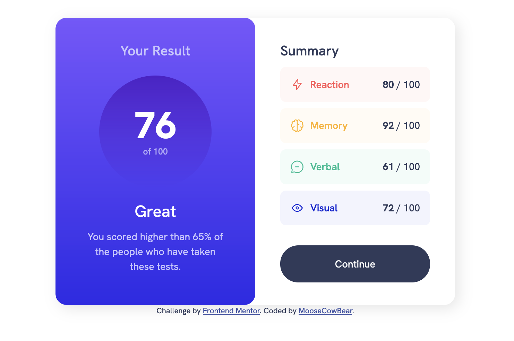
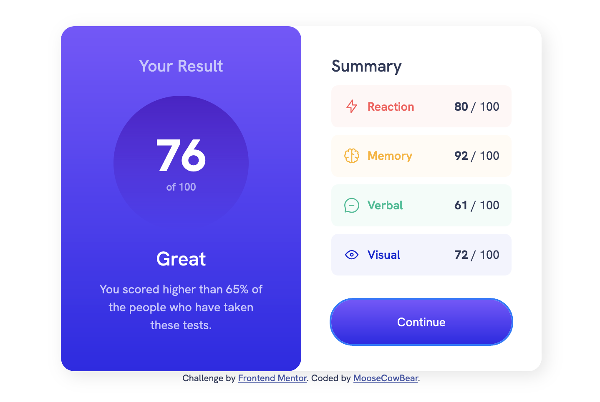

# Frontend Mentor - Results summary component solution

This is a solution to the [Results summary component challenge on Frontend Mentor](https://www.frontendmentor.io/challenges/results-summary-component-CE_K6s0maV).

## The challenge

Users should be able to:

- View the optimal layout for the interface depending on their device's screen size
- See hover and focus states for all interactive elements on the page

## Design Choices

In this challenge we were given the option of dynamically adding data from a JSON file. I opted to do this, and added a visual error message in the event that the JSON data failed to load. 

## Screenshots

## Links

- [Solution]()
- [Live]()

## Built with

- Semantic HTML5 markup
- CSS custom properties
- Flexbox
- CSS Grid

## Useful Resources

[This Stack Overflow for reading a JSON file]([This Stack Overflow)

## Author

- GitHub - [MooseCowBear](https://github.com/MooseCowBear)
- Frontend Mentor - [@MooseCowBear](https://www.frontendmentor.io/profile/MooseCowBear)